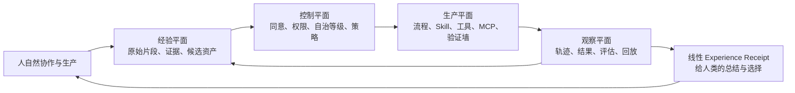

# Experience OS 3.0: 可用性与可信自治路线图

日期：2026-07-18  
状态：规划已确认，待按阶段实施

## 1. 这次升级的判断

2.0 已经证明了一个完整的工程原型可以跑通：经验对象可以保存、审查、版本化、导出、交易，也有可视化工作台。但它还不是一个普通人会自然持续使用的产品。当前工作台更像 OS 控制台，而不是用户开始一项真实工作的入口。

3.0 不以增加更多列表、市场功能或自动生成数量为目标。它要证明一件更难也更核心的事：

> 用户只需自然地开始协作与生产，Experience OS 就能以可追溯、可撤回、可审查的方式，把真正有用的经验沉淀下来，并在合适的下一次工作中主动而克制地帮上忙。

这仍然是“自动经验资产化”，但加入三个不可缺少的限定：**有证据、可控制、经结果验证**。

## 2. 对原有哲学的保留与修订

### 保留的核心

1. 中心功能不是 Skill 商店，而是自动经验资产化。
2. 协作可发散，生产必须收敛。前者产生可能性，后者对可能性负责。
3. 墙壁不是限制创意，而是把工程事实转译为人可以调整的反馈。
4. 人类不应被迫学习复杂的资产管理；系统应在后台观察、提议、复用和适配。
5. 偏好是待证实的假设，不是对人的永久定义。

### 必须修订的地方

| 原有直觉 | 风险 | 3.0 的修订原则 | 工程落实 |
| --- | --- | --- | --- |
| “顺应人的懒惰” | 容易把人简化成只追求省事，也可能使系统偷偷代办 | 降低认知交易成本，同时保留理解、选择与撤回 | 每个重要动作提供原因、影响、备选与撤回路径 |
| “非线性思想无失真转线性” | 完全无失真不可能；摘要会丢失语气、分叉和不确定性 | 建立“忠实压缩契约”，不宣称无损 | 保留原始片段、来源、解释、替代解释、不确定性和适用边界 |
| “越自动越好” | 自动化会放大错误、越权和信任错配 | 自动化等级必须随风险、可逆性和证据强度变化 | Explore / Advise / Draft / Execute / Commit 五级自治 |
| “AI 逐步适应人” | 可能形成陈旧记忆、隐性画像和确认偏误 | 适应必须可见、可反驳、可过期、可删除 | 偏好证据、衰减、矛盾检测、挑战模式、同意范围 |
| “Skill 是核心资产” | Skill 同时被当作知识、流程、工具和权限，语义会坍缩 | 资产、能力和权限必须分离 | Recipe / Evidence / Capability / Policy 四类对象 |
| “撞墙即反馈” | 只记录硬失败会遗漏低置信、冲突和潜在风险 | 失败与不确定性都应成为可处理信号 | Hard Block、Soft Risk、Stale Memory 等统一风险事件 |

一句话说，3.0 的人文立场不是“AI 替人完成一切”，而是：**让人少做机械劳动，却始终知道系统依据什么、正在改变什么，以及如何收回决定权。**

## 3. 产品的四个平面

### 3.1 经验平面：把“记住”变成可验证的主张

新增或重构的领域对象：

- `EvidenceLink`：一个结论引用的原始对话、文件、改动、测试或用户反馈；包含来源、片段、时间、权限范围和可靠性。
- `AssetClaim`：系统从证据中提出的经验主张，例如“该用户倾向先给结构再展开”。必须包含反例、适用条件和不确定性。
- `AdaptationProfile`：由多个 `PreferenceHypothesis` 组成的临时适应档案，不直接等于用户画像。
- `ContradictionSignal`：新证据与旧主张冲突时生成，阻止静默覆盖。
- `MemoryLifecycle`：`candidate -> supported -> active -> stale -> archived/retracted`，附带过期时间与复核条件。

### 3.2 控制平面：经验不是权限

- `ConsentScope`：用户明确允许系统观察、保存、复用或共享的范围；默认最小化，支持随时撤销。
- `ExecutionPolicy`：定义什么任务可自动草拟、什么任务必须确认、什么能力不可调用。
- `CapabilityGrant`：一个 Skill/Recipe 获得调用 MCP、文件写入或外部服务能力时的独立授权记录。
- `AutonomyMode`：按本次任务选择的自治等级，而非全局开关。

### 3.3 生产平面：发散经过可验证的漏斗

生产部分沿用并强化现有“脚手架、规则、验证、降级、WallHit”体系：

- 所有会产生副作用的步骤都必须有输入 schema、输出 schema、前置条件、失败处理和回滚策略；
- Skill 只描述可复用流程；Capability 才能执行工具调用；Policy 决定是否允许这一次调用；
- 每个稳定资产必须有一个最小的评估集和基线对照，不能只因模型自评“有用”就升级；
- 系统失败时输出可读的工程事实，而不是模糊道歉。

### 3.4 观察平面：让系统对自己的学习负责

- `OutcomeRecord`：记录最终交付、成功条件、用户修改、耗时、验证结果和满意/不满意信号。
- `DecisionReceipt`：每次关键决策生成“用了什么、为什么、改变了什么、如何回退”的收据。
- `EvaluationCase`：从真实项目抽取并匿名化的可回放任务，作为资产升级的保留测试。
- `RegressionSuite`：候选资产不能破坏已通过的任务；模型、Prompt、Skill、规则的变化都要进行回放比较。
- OpenTelemetry 兼容轨迹：记录请求、工具、模型、成本、延迟、策略判定和 WallHit，避免只看最终成功/失败。

## 4. 用户真正会用的主闭环

首屏不应是九个管理视图，而应是一个项目入口：用户输入目标、贴入材料、开始讨论或连接工作区。控制台仍保留，但退到“高级管理”。

1. **开始**：用户打开一个项目，直接表达任务或导入工作材料。
2. **协作**：AI 可以发散、提出方案和反例；系统只在已获同意的范围内采集候选经验。
3. **提议**：系统在恰当时机展示一张简短的“Experience Receipt”：它观察到了什么、建议复用什么、证据是什么、预期收益和风险是什么。
4. **生产**：用户进入产出时，系统切换到对应自治等级。架构、测试、权限、代码边界成为显式墙壁。
5. **验证**：交付物经过测试、预览、规则校验或人工确认。失败、冲突和不确定性均形成结构化反馈。
6. **沉淀**：只有被结果支持的候选才获得更高可信度；被否定的主张会衰减、归档或保留为反例。
7. **下次复用**：系统优先建议而非强行套用，并显示其在相似上下文中的真实效果。

### 每次关键动作的“四问”

人不需要读原始 JSON，但任何动作都必须能回答：

1. 系统将使用或改变什么？
2. 为什么现在做这件事？证据是什么？
3. 还有哪些选择，风险和不确定性在哪里？
4. 结果是什么，如何停止或回退？

这就是线性 Human Review 的升级版本，也是反黑箱的最小承诺。

## 5. 自治状态机与升级规则

| 模式 | 可以做什么 | 不可以做什么 | 典型场景 |
| --- | --- | --- | --- |
| `explore` | 发散、假设、反例、模拟 | 改变状态、调用外部能力 | 讨论、写作、方案探索 |
| `advise` | 引用证据提出建议 | 写入资产或执行副作用 | 推荐已有经验 |
| `draft` | 创建可撤销候选、草稿、审查包 | 升级为稳定资产、外部提交 | 从工作过程提炼经验 |
| `execute` | 在已授权能力内执行可逆步骤 | 不可逆发布、敏感外部动作 | 受控代码生成、文件修改 |
| `commit` | 执行明确确认或预授权的高影响动作 | 绕过策略与审计 | 发布、付费、共享、删除 |

升级到 `stable` 的候选资产至少需要：

1. 可追溯的 `EvidenceLink`；
2. 至少一个相似任务上的结果证据，或清楚标注“尚未验证”；
3. 基线比较，不低于未使用资产的表现；
4. 不触发未解决的 `ContradictionSignal`；
5. 满足相应风险等级的审查规则。

自我迭代只能创建 `candidate` 与 `ChangeProposal`，不得自行扩大权限或自行升级为 `stable`。这是防止“会自我学习”悄悄变成“会自我放大”的硬边界。

## 6. WallHit 2.0：从报错记录到决策接口

`WallHit` 扩展为以下类型：

- `HARD_BLOCK`：schema、测试、权限或安全规则不允许继续；
- `SOFT_RISK`：可以继续，但成本、影响或失败概率明显升高；
- `NEEDS_DECISION`：存在价值取舍，不能由系统替人决定；
- `LOW_CONFIDENCE`：证据不足，建议先验证；
- `POLICY_DENIED`：能力或数据权限不足；
- `STALE_MEMORY`：拟复用的经验已过期或上下文不匹配；
- `CONTRADICTION`：新旧证据支持相反主张。

每个 WallHit 都必须输出：`impact`、`evidence`、`safeAlternatives`、`requiredHumanDecision`、`acceptanceCriteria`、`replayCase`。这样“撞墙”不只是 AI 的失败，也是人的下一步地图。

## 7. 衡量产品是否真的帮助了人

下载量、资产数量、模型自评和单次满意度都不足以证明价值。3.0 建立四层指标：

| 层级 | 核心问题 | 初始指标 |
| --- | --- | --- |
| 体验 | 用户是否少做了无意义的重新解释？ | `timeToUsefulContext`、项目首个可用产出时间、手动上下文补充次数 |
| 适配 | 建议是否在正确的人和上下文出现？ | 建议接受率、复用后人工改写率、错误复用率、撤回率 |
| 结果 | 资产是否真的改善生产？ | 对照任务成功率、验证通过率、返工次数、结果质量人工评分 |
| 信任与安全 | 系统是否把控制权留在人手里？ | 策略拒绝正确率、未授权动作数、陈旧记忆命中率、WallHit 复发率、审查完成时间 |

每个候选 Skill/Recipe 的价值都必须在“使用它”和“未使用它”的相近任务上比较。不能把市场下载、平均评分直接当作个人适配性证据。

## 8. 实施路线

### 阶段 0：纠偏与基线（1 周）

目标：先保证已有原型的数字可信、行为可回归。

- 修复交易下载数被重复记账的问题，并补充端到端断言；
- 将目前 demo/verify 转为固定种子隔离 Vault，避免测试数据污染产品指标；
- 建立 React 关键路径 E2E：启动项目、候选审查、WallHit、购买/评分各一条；
- 在 README 与工作台明确区分“原型控制台”和“真实项目入口”；
- 为现有 2.0-C 指标加入来源说明，避免把模拟交易视作市场证明。

验收：CI 中每次变更可重复运行；同一笔购买只记一次下载；产品数据与验证夹具分离。

### 阶段 1：真实经验闭环 Alpha（4-6 周）

目标：让 5-10 位早期构建者在真实项目中完成一次自然闭环。

- 新增 `Project`、`EvidenceLink`、`AssetClaim`、`OutcomeRecord`、`DecisionReceipt` 的 schema、迁移与校验；
- 建立“项目入口 + 工作流时间线 + Experience Receipt”，将九视图工作台定位为高级控制台；
- 接入真实 LLM provider，但所有模型输出先进入 `draft`；
- 从对话、文件改动、测试结果中抽取候选资产，并显示对应原始证据；
- 允许用户接受、改写、拒绝、过期或删除候选，收集原因；
- 生产任务采用 `ExecutionPolicy` 与 `AutonomyMode`，先覆盖代码生成/文档生产两类低风险场景。

验收：至少 3 个真实项目各有一次“候选经验 -> 复用建议 -> 结果记录”；用户能在 30 秒内理解并处理一张 Receipt；所有资产可追溯到来源与撤回路径。

### 阶段 2：可信适应与自我迭代 Beta（6-8 周）

目标：系统开始学习，但学习始终受证据和回归约束。

- 实现 `MemoryLifecycle`、过期/衰减、矛盾检测、挑战模式和一键停止学习；
- 将 `PreferenceHypothesis` 改造为证据加权、带适用范围的假设；
- 增加 `EvaluationCase` 与 `RegressionSuite`，每次 Skill/Prompt/规则变更进行前后对照；
- 自我迭代输出 `ChangeProposal`，自动附带收益预期、风险、测试结果和回滚方案；
- WallHit 2.0 与线性决策界面落地；
- 用 OpenTelemetry 兼容 trace 连接模型、工具、策略、验证、结果。

验收：候选资产不会因一次成功自动稳定；过期或矛盾记忆不会被静默复用；每次稳定升级都能查看基线、回放与审查证据。

### 阶段 3：生产可用基础（4-6 周）

目标：从单机原型变成可托付真实数据的单租户产品。

- JavaScript 渐进迁移为 TypeScript；API 层收敛到 Fastify + schema；
- 单用户以 SQLite + 本地对象文件起步，预留 PostgreSQL、多租户和对象存储迁移路径；
- 建立用户身份、会话、RBAC、加密密钥、备份恢复、数据导出与删除；
- 用 outbox/队列处理 LLM、评估、Git、MCP 等慢任务，保证幂等与可恢复；
- Docker 化、CI、迁移演练、日志脱敏、错误预算和灾难恢复演练；
- MCP 只作为受 `CapabilityGrant` 和 `ExecutionPolicy` 约束的执行通道，不让导入的 Skill 自动获得工具权限。

验收：一次进程中断后任务可恢复；撤销同意会停止后续学习与能力调用；关键动作有审计、最小权限和备份恢复路径。

### 阶段 4：团队与市场，条件式启动（后置）

市场不是 3.0 的主航道，只有在个人闭环证明有效后再扩大。

- 团队共享时，资产默认是候选和可见范围受限的，不默认全员复用；
- 市场 Listing 附带“证据卡”：适用上下文、版本、测试集、已知失败、权限需求、隐私级别；
- 质量排序优先看可复现实效与兼容性，而非下载量；
- 支付、授权与商业化只在安全、税务、退款和纠纷规则明确后接入真实外部支付。

启动门槛：Alpha/Beta 的复用结果显示可测改善，且错误复用、未授权动作、撤回率均处于可解释和可控制范围。

## 9. 近期执行顺序

下一轮开发按下面顺序推进，避免再次被“看起来完整”的功能面带偏：

1. 修复 Marketplace 一笔购买被记为两次下载，并加回归测试。
2. 把 `verify` 的 fixture Vault 与真实工作 Vault 分离。
3. 新建 `Project` 与 `EvidenceLink` 的 TypeScript/运行时 schema、迁移和单测。
4. 实现项目时间线与最小 Experience Receipt API，先不接复杂个性化。
5. 建立 `AutonomyMode` / `ExecutionPolicy`，把现有代码生产流程接入 `draft` 与 `execute` 两档。
6. 为每次执行写 `DecisionReceipt` 与 `OutcomeRecord`。
7. 将现有 WallHit 升级为“影响、证据、选择、验收条件、回放”的可读格式。
8. 创建 10-20 个来自真实项目的匿名化评估任务，作为第一版回归集。
9. 接入真实 LLM 的受控 Alpha，默认无副作用、可见成本、可暂停。
10. 邀请首批用户做三项目试用，依据指标决定是否进入记忆自适应。

## 10. 不做的事情

在阶段 1-3 完成前，不把以下事项误当作进展：

- 不继续用新增 Marketplace 列表、定价或模拟交易替代真实复用证明；
- 不把“生成更多 Skill”当作学习质量；
- 不允许导入/自生成 Skill 自动获得文件、网络或 MCP 执行权限；
- 不把用户的偏好写成永久人格标签；
- 不用模糊置信度替代证据、测试和人的价值判断。

## 11. 研究依据

- Microsoft Research, [Guidelines for Human-AI Interaction](https://www.microsoft.com/en-us/research/publication/guidelines-for-human-ai-interaction/)：纠错、能力边界、失败处理、控制权与信任校准。
- Parasuraman, Sheridan, Wickens, [A Model for Types and Levels of Human Interaction with Automation](https://pubmed.ncbi.nlm.nih.gov/11760769/)：自动化应随阶段与风险调节，而非二元选择。
- Ben Shneiderman, [Human-Centered Artificial Intelligence](https://arxiv.org/abs/2002.04087)：可靠、安全、可信且人类保持控制。
- NIST, [AI Risk Management Framework](https://www.nist.gov/itl/ai-risk-management-framework) 与 [Generative AI Profile](https://nvlpubs.nist.gov/nistpubs/ai/NIST.AI.600-1.pdf)：治理、映射、测量、管理的风险闭环。
- Memora, [From Recall to Forgetting](https://arxiv.org/abs/2604.20006)：长期个性化记忆的陈旧与更新风险，支持“可遗忘的适应”。
- Reflexion, [Language Agents with Verbal Reinforcement Learning](https://arxiv.org/abs/2303.11366)：失败轨迹和语言反馈可以促进后续改进，但必须关联结果。
- ArguMentor, [Counter-Argument Generation for Human-AI Collaboration](https://arxiv.org/pdf/2406.02795)：把反论证显式放入流程，可降低确认偏误。
- SWE-bench, [Can Language Models Resolve Real-World GitHub Issues?](https://arxiv.org/abs/2310.06770) 与 [SWE-Bench+](https://arxiv.org/abs/2410.06992)：真实工程能力必须以执行和可靠评估验证，不能只看表面通过率。
- OWASP, [Top 10 for Large Language Model Applications](https://owasp.org/www-project-top-10-for-large-language-model-applications/)：Prompt Injection、过度代理等风险要求权限与能力分离。
- Model Context Protocol, [Authorization Specification](https://modelcontextprotocol.io/specification/2025-06-18/basic/authorization)：MCP 访问应代表资源所有者并受授权约束。
- OpenTelemetry, [Semantic Conventions](https://opentelemetry.io/docs/concepts/semantic-conventions/)：可互操作的观察与追踪基础。
- W3C, [WCAG 2.2](https://www.w3.org/TR/WCAG22/)：可理解性和认知可达性应进入核心界面要求。

